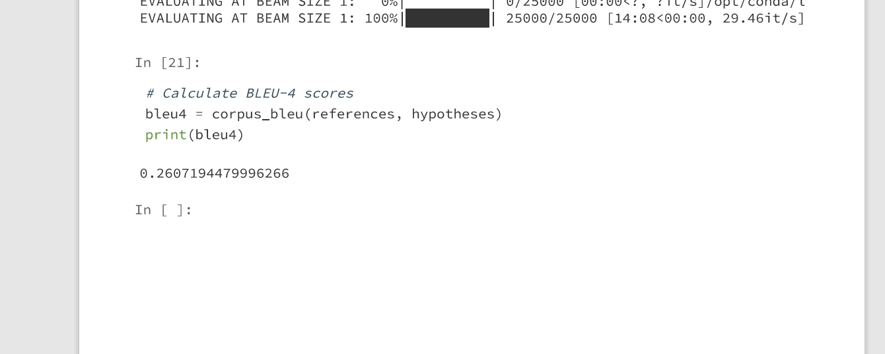

# image_caption_generation

# 案例6：图像自然语言描述生成实验报告

自己的理解：相当于对人看图片是脑中产生对这个图片的理解认知的子动态过程进行建模 encoder是人眼得到的特征给到脑内部神经网络进行识别，相当于作为decoder的输入 输出就是人对于这个图片的认知，RNN可以用到很多这类过程中 比如语音识别、翻译等。

# 主要技术点

- 图像自然语言处理原理（这涉及到序列1-\>序列2 图像到语言）
- 编码器和解码器（这个实验的编码器就是图像特征提取（resnet101）解码器就是rnn/rnn+attention. ps本来想用一下vit 但是没来得及训练了 ， 学完了vit的概念）
    - 
- 知识点
    - RNN
        - 
        - 
        - 动态系统中多数都带有时序的 
        - teacher forcing：（把对的标签直接放到训练中，但是在测试中是没有对的标签的 所以这个策略也比较麻烦）
            - 
        - 双向RNN（可以学到前后的信息）
            - 
        - 由于上面的网络记忆太短 因为纯RNN面临着指数衰减的问题 只能记得附近的数据所以提出了LSTM（门控RNN）几个门的参数也是通过学习得到的
        - LSTM（感觉老师一个个说过来好清晰）
            - 
            - 
            - 
    - Attention
        - 解决RNN无法关注源语句中最有用的特征的问题
        - 
        - 与源语句做点积关注重要的部分，对当前态有用的特征
        - 
    - adaptive attention（带已经生成的记忆的attention,就是记得之前输出的attention）
        - adaptive attention 和 attention 
            - 
        - Adaptive Attention 主要研究在“看图说话”中，有些非视觉词(比如 the，of 等) 的生成，并不需要视觉信息，它们的梯度反而会影响到视觉信息的有效性。而且，有些看似需要视觉特征来生成的词，也可以通过人类的语言模型预测出来 (比如 “taking on a cell” 后面生成 “phone”)。为了解决这个问题，作者基于spatial attention model，设计了蕴含历史信息的 visual sentinel，来表示已生成文本的历史信息。然后引进一个参数，来控制 attention 中视觉信息和历史信息的比重。相当于从时间的维度来决定什么时候看，看多少。提出了带有视觉标记的自适应的 attention 模型（adaptive attention model with a visual sentinel），使得模型在生成每一个词时，可以决定需要关注图像本身还是只需要依靠语言模型。如果判断需要关注图像，再通过 spatial attention 来决定关注图像的哪个区域。
        - 作者认为对于非视觉词，它们的生成应该取决于 历史信息而不是视觉信息，因此在这种情况下应该对视觉信息加以控制。所以在此处引进 visual sentinel。通过在 spatial attention model 中添加新元件 visual sentinel，就得到了adaptive attention model。（相当于将模型更加细分了，利用domain knowledge ）
            - 

# 编码：word2vector

- onehot编码
    - 无法表示词与词直接的关系
    - 占用的空间太大
    - 算softmax太耗时 

## one-hot方式将word进行vector化的方法忽略了词与词之间的关系（比如说,dog和cat都是动物，并非完全无关系）。维度太高的向量作为模型输入会导致模型变的复杂（模型复杂需要更多的训练样本才能够收敛）。那么是否存在一种更加合理的对词的用向量的表达方式呢？有的，其实就是word embedding。word embedding简单来讲就是将高维稀疏的向量降维成稠密的低维向量。（一种高维到低维的映射）。

- CBOW（Continuous Bag-of-Words）
    - 将一个词所在的上下文中的词作为输入，而那个词本身作为输出。
    - 
    - 
    - [1,0,1,0,0]-\>[0,1,0,0,0]多到少
- Skip-Gram
    - 将一个词所在的上下文中的词作为输出，而词本身作为输入。
    - 
    - 
    - 少到多
- word2vector
    - Word2Vec是从大量文本语料中以无监督的方式学习语义知识的一种模型，它被大量地用在自然语言处理（NLP）中。那么它是如何帮助我们做自然语言处理呢？Word2Vec其实就是通过学习文本来用词向量的方式表征词的语义信息，即通过一个嵌入空间使得语义上相似的单词在该空间内距离很近。Embedding其实就是一个映射，将单词从原先所属的空间映射到新的多维空间中，也就是把原先词所在空间嵌入到一个新的空间中去。
    - Word2Vec模型中，主要有Skip-Gram和CBOW两种模型，从直观上理解，Skip-Gram是给定input word来预测上下文。而CBOW是给定上下文，来预测input word。
    - 
    - 主要是获得训练得到的隐层（这个任务也称为Fake Task）
    - 

# 评价指标BLEU4

- Bleu[1]是IBM在2002提出的，用于机器翻译任务的评价，发表在ACL，引用次数10000+，原文题目是“BLEU: a Method for Automatic Evaluation of Machine Translation”。
- 它的总体思想就是准确率，假如给定标准译文reference，神经网络生成的句子是candidate，句子长度为n，candidate中有m个单词出现在reference，m/n就是bleu的1-gram的计算公式。
- BLEU还有许多变种。根据n-gram可以划分成多种评价指标，常见的指标有BLEU-1、BLEU-2、BLEU-3、BLEU-4四种，其中n-gram指的是连续的单词个数为n。
- BLEU-1衡量的是单词级别的准确性，更高阶的bleu可以衡量句子的流畅性。

# 模型架构

# 实验结果

- RNN结果
    - 可视化（自己的桌面 确实没有把杯子鼠标等物件弄出来）
        - 
    - 测试（0.2747）
        - 
    - 参数
        - 

- RNN+Attention结果
    - 可视化
        - 
    - 测试（0.26）
        - 
    - 参数
        - 

# 实验总结

本次实验，终于学会了RNN的和Attention，rnn（指多种变体的门控rnn），明白了动态系统建模的过程，attention好像人去判断一些事情 只需要靠着一点重要信息就可以知道结果。

学到了自然语言处理中的w2v 处理词与词之间的关系，使用神经网络去学习然后获得隐层，隐层中有着词与词之间的关系。

# 参考文献/博客

1.[https://zhuanlan.zhihu.com/p/223048748](https://zhuanlan.zhihu.com/p/223048748)

2.Xu K, Ba J, Kiros R, et al. Show, attend and tell: Neural image caption generation with visual attention[C]//International conference on machine learning. PMLR, 2015: 2048-2057.

3.[https://github.com/sgrvinod/a-PyTorch-Tutorial-to-Image-Captioning#some-more-examples](https://github.com/sgrvinod/a-PyTorch-Tutorial-to-Image-Captioning#some-more-examples)

4.[https://zhuanlan.zhihu.com/p/55127218](https://zhuanlan.zhihu.com/p/55127218)

5.[https://zhuanlan.zhihu.com/p/566699160](https://zhuanlan.zhihu.com/p/566699160)

6.[https://www.leiphone.com/category/yanxishe/PamWKpfRFEI42McI.html](https://www.leiphone.com/category/yanxishe/PamWKpfRFEI42McI.html)

